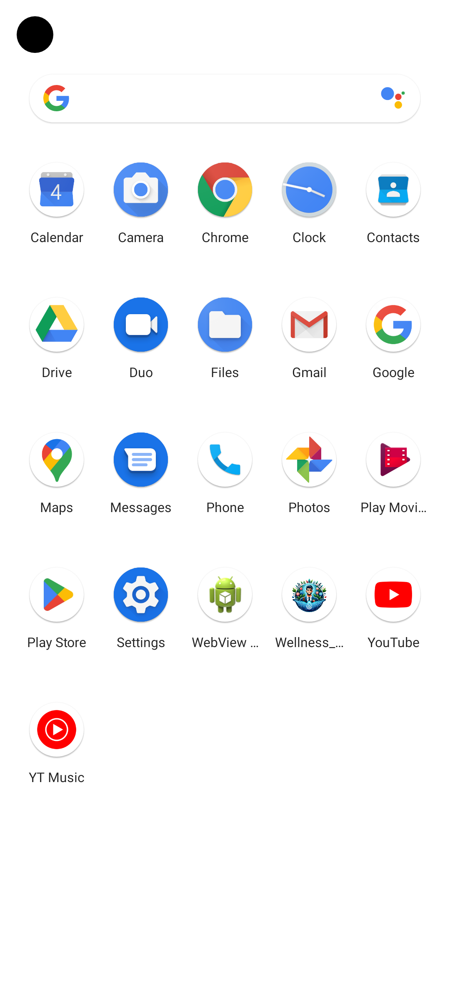
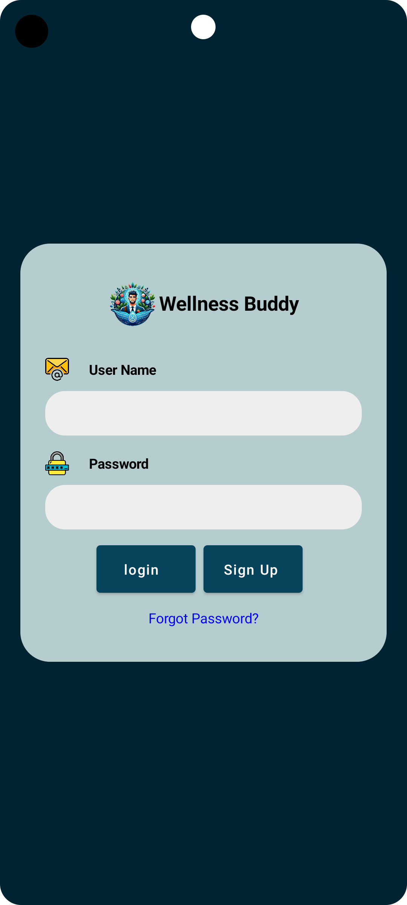
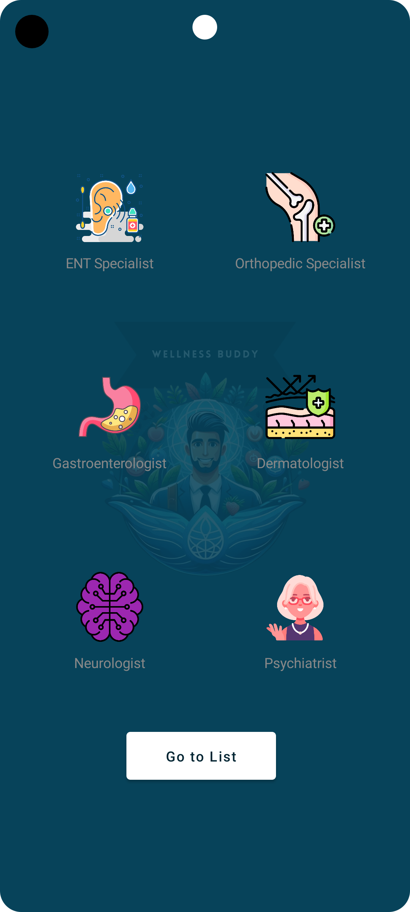
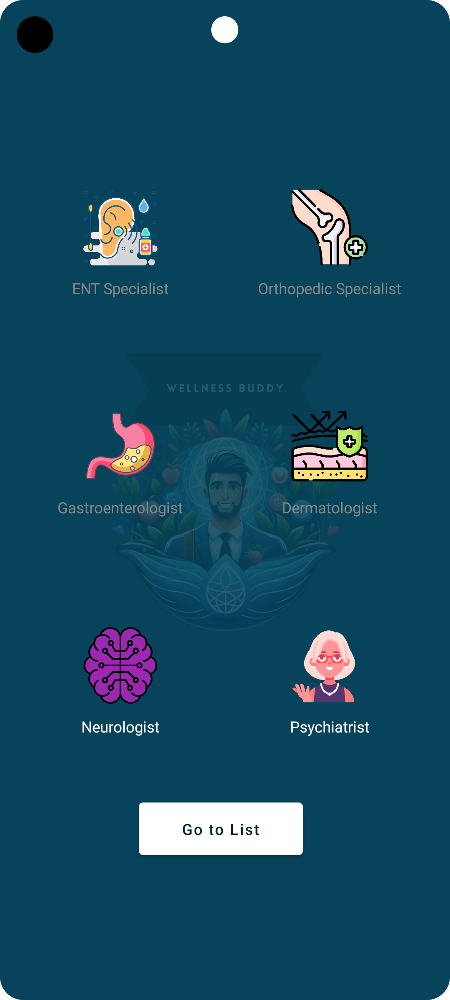
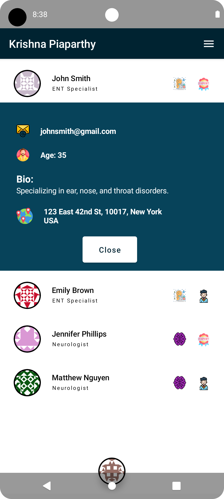
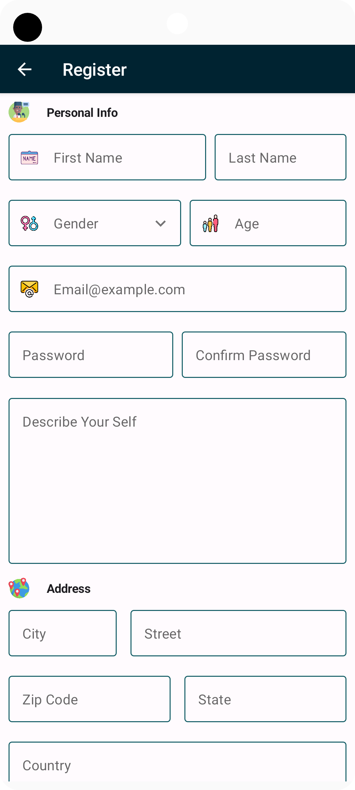
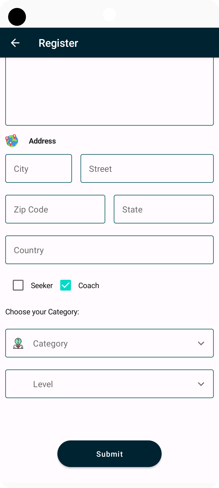

  
    
   
  <h1>Wellness Buddy</h1>

### Overview

Our Wellness Buddy application is implemented to educate users with health problems in that way that they can choose their health conditions or their main goals. Users can choose their problem and make a direct connection with a Health Coach, which may be a certified professional or a just graduated student who is a specialist in their field of interest. Our focus is to keep users with us on their health journey where they regain their health control and have better wellbeing. Our goal is to provide everyone with affordable, reliable, and efficient career/student counseling services.

### Key Features

#### 1. User Profile Creation:

- Personalized user profiles

#### 2. Wellness Buddy Matching:

- Depend upon the health condition which user choose we will provide direct connection with coaches ( Certified or student studying in that profession )

#### 3. In-App Messaging and Communication:

- Users can chat with their coaches securely and privately.

#### 4. Contact Us Page:

- For any help or guidance users / coaches can reach out to help desk throughout the form

#### 5. About Us Page:

- We are going to provide the basic information about the application. For example, what does this application do?

#### 6. Feedback and Rating System:

- In the application itself users can rate their coaches ( Certified or student studying in that profession ) who connected with them.

### Future Works

#### 1. Appointment Scheduling:

- Users can schedule an appointment with .coaches so that they can understand more about coach and vice versa

### Targeted Audience:

So the specific health conditions users face on a yearly basis are going to be treated or given guidance by these health coaches.

#### Specific health conditions, Example:

- ENT Issues (Cough, cold, headache, sleep apnea, ear pain)
- Orthotic Issues (Joint Pains, Back/Spine Pain, Foot and Ankle Problems, Hand/Wrist Problems)
- Gastro issues (ulcers)
- Dermato issues (blackheads, pimples, acne, dry skin, rashes)
- Neuro (Weakness, Facial Pain, Fatigue, Cramps)
- ... and more

#### User Types

- **Y**: Coaches (certified or students learning in the respective field)
- **X**: Users facing the mentioned health conditions.

 Users (X) can reach out to coaches (Y) through our platform. 

### Technology Used
<ul>
<li>Used Jetpack</li>
<li>Used Kotlin for creating the application.</li>
<li>Gradle for package management</li>
<li>And for databases we have used firebase to handle realtime data.</li>
<li>For random avatar Api: <a href="https://www.gravatar.com/avatar/">https://www.gravatar.com/avatar/ </a></li>
<li>Firebase Api <a href="https://wellness-buddy-3bf23-default-rtdb.firebaseio.com/
">https://wellness-buddy-3bf23-default-rtdb.firebaseio.com/</a></li>
</ul>

### Our Work
<table style="width:100%">
  <tr>
    <td style="padding:20px; width: 200px;">
      
    </td>
    <td style="padding:20px; width: 200px;">
      
    </td>
    <td style="padding:20px; width: 200px;">
      
    </td>
    <td style="padding:20px; width: 200px;">
      
    </td>
  </tr>
  <tr>
    <td style="padding:20px; width: 200px;">
      
    </td>
    <td style="padding:20px; width: 200px;">
      
    </td>
    <td style="padding:20px; width: 200px;">
      
    </td>
    <td style="padding:20px; width: 200px;">
      
    </td>
  </tr>
  <!-- Add more rows as needed -->
</table>

### Conclusion:

The Wellness Buddy app implements a user-oriented platform that promotes individuals to find access to either certified advisors or student advisors. Features like the direct communication, and the feedback system from users are the strategies the app uses to help in the wellness journey of the users. The aim of our organization is to provide everybody with professional and student wellness services that are quick and easy to use and help people be more confident with their health and successfully attain their wellness targets.

### Resources

This is our [Idea Proposal](https://docs.google.com/document/d/1C8_9gd_1M1Xrq3yuvweFGy80IgsbAsMhczvUfKRwSqI).

For more details, please refer to our  [Final Documentation](https://docs.google.com/document/d/1EEotQDDc-4aDZyCh7jExew_is8e8B4NEQR0w0D4r9kk/edit).

You can download [APK](https://github.com/S-A-T-Y-A/Wellness-Buddy/blob/main/WellnessBuddy.apk) here.

### Contributers

<table style="border-collapse: collapse; border: none;">
<tr align="center" style="border-collapse: collapse; border: none;">
<td style="border-collapse: collapse; border:none">Koundinya Pidaparthy</td>
<td style="border:none">Satya Nandan Thota</td>
<td style="border:none">Sri Ramgopal Tandra</td>
</tr>
<tr align="center">
<td style="border:none"><a href="https://github.com/koundinyapidaparthy2" style="text-decoration: none;">
    </img>
  </a></td>
<td style="border:none"></td>
<td style="border:none"><a href="https://github.com/SR-Naidu" style="text-decoration: none;">
    </img>
  </a></td>
</tr>
</table>
